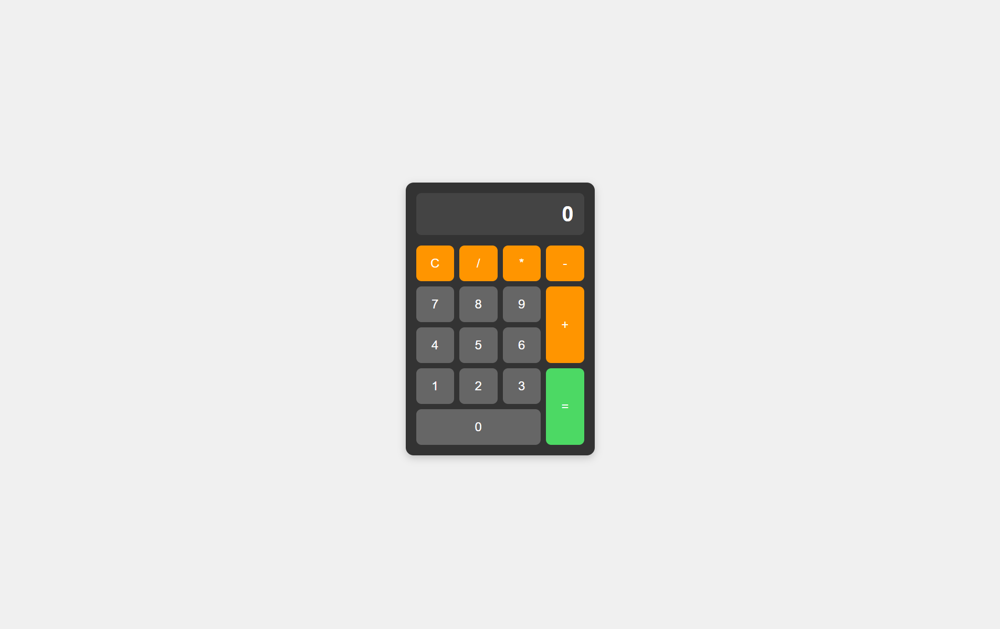

<h1 align="center">Web Calculator</h1>

<p align="center">
  
  
  
</p>

<h3 align="center">
  <a href="https://tsalis-dev.github.io/your-calculator-repo-name/">🚀 Live Demo 🚀</a>
</h3>

<p align="center">
  A functional calculator project built with fundamental web technologies. This project demonstrates DOM manipulation, event handling, and modern layouts with CSS Grid.
</p>

---

## Key Features

- **Basic Arithmetic Operations:** Performs Addition (+), Subtraction (-), Multiplication (*), and Division (/).
- **Interactive Display:** The calculator screen updates dynamically as buttons are pressed.
- **Clear Function (C):** Resets all input and returns the display to 0.
- **Error Handling:** Displays an 'Error' message for invalid calculation inputs (e.g., `5*/2`).
- **Modern Layout:** Built using CSS Grid for a precise and responsive button layout.

---

## Tech Stack

| Category | Tools |
|-----------|--------|
| Frontend | **HTML5**, **CSS3** (Flexbox, Grid), **Vanilla JavaScript** (DOM Manipulation, Event Listeners) |
| Version Control | Git, GitHub |
| IDE | Visual Studio Code |

---

## Getting Started / Running Locally

```bash
# 1. Clone this repository
git clone [https://github.com/tsalis-dev/your-calculator-repo-name.git](https://github.com/tsalis-dev/your-calculator-repo-name.git)

# 2. Navigate to the project directory
cd your-calculator-repo-name

# 3. Open the index.html file in your browser
start index.html
```

## 📸 Preview



---
